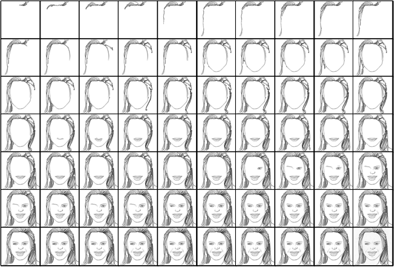
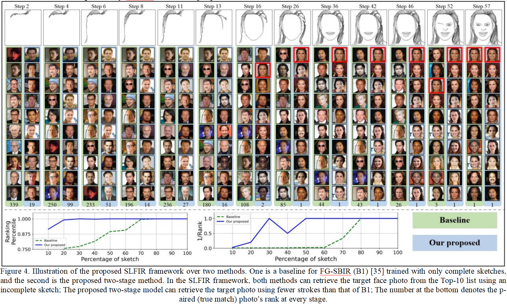

# FS2K-SDE Dataset

**Chinese**		**[English](README_EN.MD)**

FS2K-SDE指FS2K sketch drawing episode。

> 该数据集是在[@DengPingFan/FS2K](https://github.com/DengPingFan/FS2K)的基础上发展而来，主要对其中的人脸素描图片构造一个从少量笔画到完整素描的数据集，即人脸<-->素描序列。
>
> 该数据集可以很好的用于动态素描人脸检索。
>
> **下载：**直接下载仓库中dataset文件夹中的压缩包即可。

### 更新

- 2022/10/25： FS2K-SDE数据集发布！

## 介绍

我们建立了一个高质量的**人脸素描检索**数据集，取名叫做FS2K-SDE。该**数据集包含2000+人脸图像和14w+素描序列**，每个人脸图像对应的生成了70张人脸素描序列，如下图。



该数据集包含两个子集，分别为dataset1和dataset2。

其中dataset1对应着Deng数据集中的photo1和sketch1；dataset2对应着Deng数据集中的photo3和sketch3。

特别的，**在dataset1和dataset2中**：

- sketch文件夹下的内容即是素描序列；

- cleaned文件夹下的内容是对Deng数据集提供的sketch进行线条简化后的人脸素描；

**根据开源许可证MIT的要求，我们不提供原始人脸图像和原始人脸素描，该部分内容，请您到该仓库[DengPingFan/FS2K (github.com)](https://github.com/DengPingFan/FS2K)获取。**

## 数据集的文件结构

```
FS2K-SDE
├── dataset1                    (1529, source: CASIA-WebFace)
│       ├── cleaned
│       ├── sketch              (10w+, 对应FS2K的sketch1)
|              |——train         (70% of sketch)
|              |——test          (30% of sketch)
├── dataset2
│       ├── cleaned             (477, source：free stock photos websites)
│       ├── sketch              (3w+, 对应FS2K的sketch2)
|              |——train         (70% of sketch)
|              |——test          (30% of sketch)
|——README.md
```

## 实验

### SLFIR:



## 联系我们

这个数据集由戴大伟（dw_dai@163.com）和李玉堂（2018211556@stu.cqupt.edu.cn）维护。

## 引用

coming soon...