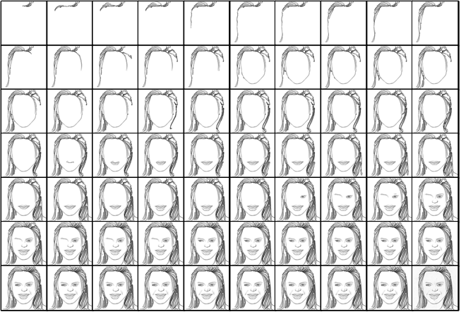
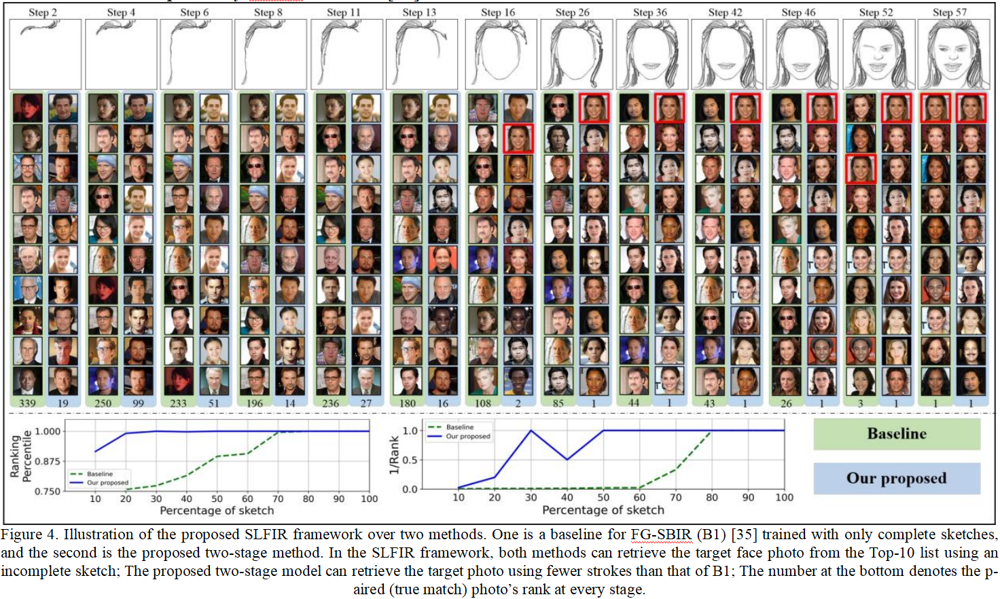

# FS2K-SDE Dataset

**[Chinese](README.md)**		**English**

FS2K-SDE means FS2K sketch drawing episode。

> This dataset is released based on [@DengPingFan/FS2K](https://github.com/DengPingFan/FS2K), which mainly constructs a dataset from a small number of strokes to complete sketches for the face sketch images in it, i.e., face <--> sketch sequence.
>
> This dataset can be well used for dynamic sketch face retrieval.
>
> **Download:** Just download the zip package in the dataset folder in the repository directly.

### Updates：

- 2022/10/25：  FS2K-SDE dataset released!

## Introduction

We built a high quality **face sketch retrieval** dataset named FS2K-SDE.The **dataset contains 2000+ face images and 14w+ sketch sequences**, each face image corresponds to 70 face sketch sequences generated, as follows.



The dataset contains two subsets, dataset1 and dataset2, respectively.

Where dataset1 corresponds to photo1 and sketch1 in the Deng dataset; dataset2 corresponds to photo3 and sketch3 in the Deng dataset.

Specifically, **in dataset1 and dataset2**：

- The contents of the sketch folder are the sketch sequence.
- The contents of the cleaned folder are obtained by line simplification of the sketch provided with the Deng dataset.

**ATTENTION:** In accordance with the requirements of the open source license MIT, we do not provide **original face images and original face sketches**, for this part, please **go to this repository [DengPingFan/FS2K (github.com)](https://github.com/DengPingFan/FS2K) to get them.** 

## File Structure

```
FS2K-SDE
├── dataset1                    (1529, source: CASIA-WebFace)
│       ├── cleaned
│       ├── sketch              (10w+, corresponding to the FS2K sketch1)
|              |——train         (70% of sketch)
|              |——test          (30% of sketch)
├── dataset2
│       ├── cleaned             (477, source：free stock photos websites)
│       ├── sketch              (3w+, corresponding to the FS2K sketch2)
|              |——train         (70% of sketch)
|              |——test          (30% of sketch)
|——README.md
```

## Experiment

### SLFIR:



## Contact

This dataset is maintained by Dawei Dai (dw_dai@163.com) and his master's student Yutang Li (2018211556@stu.cqupt.edu.cn).

## Citation

coming soon...
